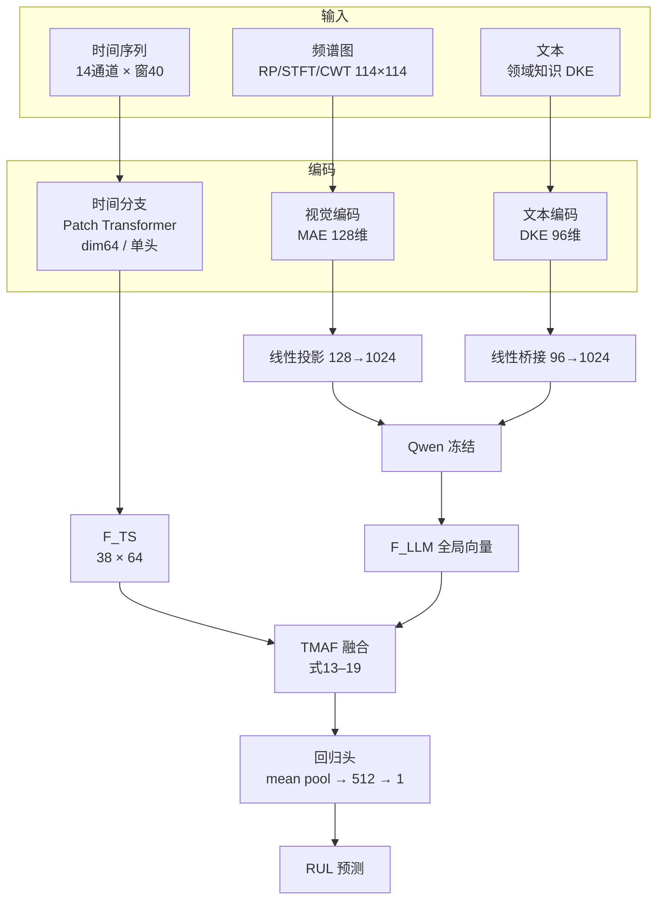
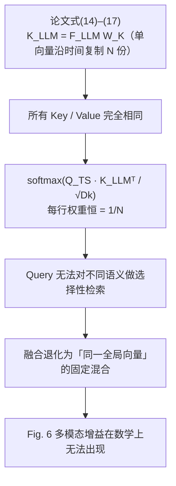
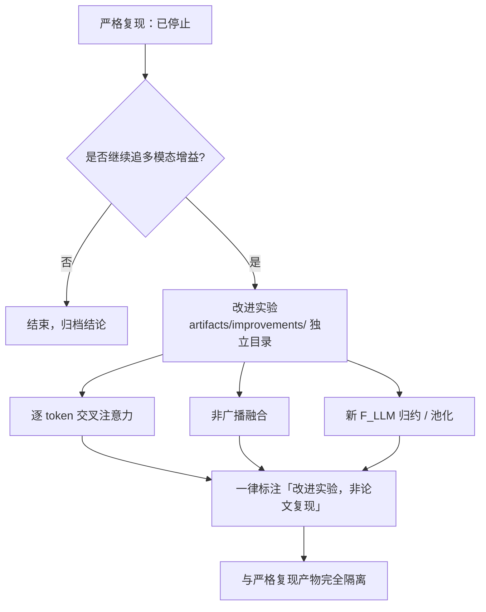

# TS-MLLM 论文复现汇报（详细版）

> 复现小组　|　面向：小组领导　|　建议时长：15–20 分钟（含讨论）
> 精简 5 分钟版见 [`REPRODUCTION_BRIEFING.md`](REPRODUCTION_BRIEFING.md)；完整证据链见 [`REPRODUCTION_CONCLUSION.md`](REPRODUCTION_CONCLUSION.md)。

---

## 0. 执行摘要（一页看懂）

**三句话结论：**

1. 按论文公开设定**忠实复现**后，**精度达不到**论文报告值（差 3–11 个 RMSE）。
2. 论文核心卖点「多模态增益」（Fig. 6）在四个数据集、三随机种子下**均未复现**。
3. 根因定位在**论文 TMAF 融合公式的内部矛盾**，属候选根因，非实现错误。

**关键数字速览：**

| 指标 | 论文 | 本复现 | 差距 |
|---|---:|---:|---:|
| FD001 RMSE | 12.45 | 16.32 | +3.87 |
| FD002 RMSE | 14.22 | 17.09 | +2.87 |
| FD003 RMSE | 11.97 | 23.43 | **+11.46** |
| FD004 RMSE | 15.94 | 19.00 | +3.06 |
| Fig.6 多模态增益 | 声称有 | **无**（4/4 子集） | — |

---

## 1. 背景与任务

### 1.1 任务定义

- **任务**：航空发动机剩余寿命预测（Remaining Useful Life, RUL），回归问题。
- **数据**：NASA C-MAPSS 四个子集，14 个有效传感器通道，滑窗 40。
- **指标**：RMSE（式 21）与 Score（式 22，对"预测过早"惩罚更重）。

| 子集 | 工况数 | 训练样本(stride50) | 测试条数 |
|---|---:|---:|---:|
| FD001 | 1 | 309 | 100 |
| FD002 | 6 | 812 | 259 |
| FD003 | 1 | 377 | 100 |
| FD004 | 6 | 938 | 248 |

### 1.2 论文方法架构

论文的核心是「多模态 + 大语言模型」：把时间序列同时转成**频谱图（视觉）**和
**文字描述（文本）**，与时间分支一起送进冻结的大语言模型 Qwen，再经 TMAF 融合层
做回归。

---

## 2. 复现范围与方法

### 2.1 已忠实实现的公开设定

论文写明的，全部照做：数据划分、传感器删选（删 1/5/6/10/16/18/19）、Min-Max 归一化、
窗口 40、滑窗 stride 50、Patch4/stride1/dim64/单头、频谱三算子、MAE 128 维、DKE 96 维、
TMAF 公式（式 13–19）、batch 128 / lr 0.002 / 30 轮。

### 2.2 明确标注的复现假设（论文未公开）

| 类别 | 假设内容 |
|---|---|
| `F_LLM` 归约 | 有效 token 的 masked mean（论文只写 `F_LLM=LLM(…)`） |
| 回归头 | mean pool → 64→512→GELU→Dropout0.5→1（表 II 只给 512/0.5） |
| 对齐训练目标 | 视觉投影对齐文本 teacher embedding 均值（MSE） |
| 主模型型号 | Qwen3-0.6B、冻结（论文只称"Qwen"） |
| 时间分支细节 | 2 层 / FFN256 / pre-norm / dropout0.1 |
| 归一化 | FD002/FD004 按工况 Min-Max（文献支持的补充预处理） |
| 目标尺度 | B = RUL/125 |

> 这些假设**逐一编号并披露**，不伪装成论文方法。

---

## 3. 结果

### 3.1 主方案精度对比

| 子集 | 归一化 | 复现 RMSE | 论文 RMSE | 差距 | 复现 Score | 论文 Score |
|---|---|---:|---:|---:|---:|---:|
| FD001 | 全局 | 16.32 | 12.45 | +3.87 | 575.46 | 233.40 |
| FD002 | 按工况 | 17.09 | 14.22 | +2.87 | 1551.20 | 929.81 |
| FD003 | 全局 | **23.43** | 11.97 | **+11.46** | 2976.50 | 338.30 |
| FD004 | 按工况 | 19.00 | 15.94 | +3.06 | 2465.36 | 1715.11 |

> FD003 差距最大（近一倍），是整体未复现最典型的样本。

### 3.2 时间基线的 batch128 vs batch32（归一化对齐后）

此前曾误把「batch128 时间基线崩成 43–44」归因于 batch size，实为**归一化混淆**。
对齐归一化后：

| 子集 | 归一化 | 时间基线 batch128 | 时间基线 batch32 | 完整TMAF batch128 | 完整TMAF batch32 |
|---|---:|---:|---:|---:|---:|
| FD001 | 全局 | 21.54 | 18.10 | 16.32 | 17.23 |
| FD002 | 按工况 | 18.72 | 17.15 | 17.09 | 17.09 |
| FD003 | 全局 | 34.67 | 19.41 | 23.43 | 21.51 |
| FD004 | 按工况 | 20.78 | 18.85 | 19.00 | 18.38 |

**要点**：完整 TMAF 对 batch size 不敏感（差 < 2）；「43–44 崩」是**旧全局 Min-Max** 的
FD002/FD004 产物，改用按工况 Min-Max 后 batch128 不崩（18.72/20.78）。

### 3.3 Fig. 6 多模态消融（核心）

统一 batch32 + figure12_v1、三随机种子（42/52/62），验证 RMSE（均值 ± 样本标准差）：

| 子集 | full（T+V+文本） | w/o Visual | w/o Textual | full − 最佳消融 |
|---|---:|---:|---:|---:|
| FD001 | 17.708 ± 0.278 | 17.773 ± 0.421 | 17.764 ± 0.403 | −0.056 |
| FD002 | 17.870 ± 0.403 | 18.028 ± 0.468 | **17.719 ± 0.192** | +0.151 |
| FD003 | 18.092 ± 0.600 | 17.685 ± 0.777 | **17.623 ± 0.293** | +0.470 |
| FD004 | 17.178 ± 0.633 | **16.917 ± 0.454** | 17.088 ± 0.350 | +0.261 |

> 正值 = 去掉某模态反而更好。四个子集里，完整模型**没有任何一个**稳定优于单模态消融；
> FD002/FD003/FD004 去掉一种模态后验证 RMSE 更低。

### 3.4 两种融合公式对比（FD003, seed42）

| 模型 | 验证 RMSE | 测试 RMSE |
|---|---:|---:|
| 纯时间 batch32（参照） | 17.9442 | 19.4100 |
| 全局广播 TMAF（论文公式字面版） | 17.4898 | 19.2494 |
| 逐 token TMAF（非论文补充版） | **17.4149** | 20.4227 |

> 逐 token 版验证仅好 0.075，测试反而差 1.17；且其注意力塌缩到固定 token（见 §4.2）。
> 说明**改架构也不一定是出路**。

---

## 4. 根因分析

### 4.1 TMAF 公式的数学退化

论文式 (14)–(17) 明文把 `K_LLM / V_LLM` 定义为单个全局向量 `F_LLM` 沿时间复制 N 份：

这是**数学必然结果**，不是实现 bug。论文行文称「选择性检索」，与其公式直接冲突
（内部矛盾 C-1）。

### 4.2 注意力均匀的实证

- **全局广播版**：38 个 Key 相同，所有时间 Query 上注意力权重严格 = 1/38，Q/K 不起选择作用。
- **逐 token 版**：虽非均匀，却塌缩到**缓存索引 3**（固定标题 `### Task Describe` 的
  ` Describe`），平均最大权重 **0.9999992**，首末 Query 注意力分布 L1 差仅 **3.39e-7**。
  「非均匀」≠「有逐 patch 选择」。

### 4.3 论文内部矛盾 / 未公开项清单

| 编号 | 事项 | 性质 |
|---|---|---|
| C-1 | 「选择性检索」行文 vs 式 (14)–(17)「广播单全局向量」 | 内部矛盾 |
| C-2 | 式 (16) `V∈R^{N×Dk}` vs 表 II "Output 32" | 内部矛盾 |
| C-3 | 正文 "residual connection" vs 式 (18)/(19) 线性门 | 措辞矛盾 |
| U-1 | `F_LLM` 如何从 LLM 序列归约为单向量 | 未公开 |
| U-2 | 回归头如何归约 N 长度 `F_fused`、激活函数 | 未公开 |
| U-3 | 式 (13) 隐含的单向量化未定义 | 未公开 |

---

## 5. 严谨性边界

1. **候选根因，非唯一根因**：均匀注意力是「最强**候选**原因」，但现有实验**不能证明**它是
   唯一原因。即使 softmax 恒为 1/N，门控（式 18/19）仍可把同一全局 value 以学习到的权重
   注入各 patch；确切缺失的是「选择性检索」，而非「多模态信息流整体为零」。
2. **未复现是"在当前统一协议 + 三随机种子下"的结论**，受限于该实验范围。
3. **论文未公开项**（`F_LLM` 归约、对齐目标、主模型型号等）仍可能影响结论，均列为假设。
4. 视觉 projector 上游以文本 embedding 为监督目标，故 `w/o Textual` 仅表示「推理无文本」，
   不代表视觉表示在训练阶段完全无文本信息。

---

## 6. 结论与建议

**结论**：不是复现没做好，而是**论文公开的公式本身撑不起它声称的「多模态增益」**。
按论文公开设定，Fig. 6 未复现、精度未达，且属论文内部方法问题。

**建议路线：**

1. **严格复现到此为止**，结论已清楚，继续调参无意义。
2. 若继续追「多模态增益」，需**改架构**，属自研新工作，**不能**再称「复现论文」。
3. 改进实验放入 `artifacts/improvements/`，与严格复现结果**彻底隔离**。

---

## 附录：证据链索引

| 文档 | 内容 |
|---|---|
| `REPRODUCTION_CONCLUSION.md` | 总结论（已实现/假设/结果/矛盾/停止理由） |
| `TMAF_METHOD_FIDELITY_AUDIT.md` | 方法保真审计（式 13–19 逐项、路径 B） |
| `FIXED_MAIN_PROTOCOL_RESULTS.md` | 主方案 `main_protocol_v1` 结果与来源 |
| `artifacts/FIGURE6_FOUR_SUBSET_BATCH32_ABLATION.md` | 四子集 Fig.6 消融原始数据 |
| `FD003_TOKEN_VS_BROADCAST.md` | 两种融合公式对比 |
| `archive/` | 历史过程记录（可追溯，不作结论依据） |
